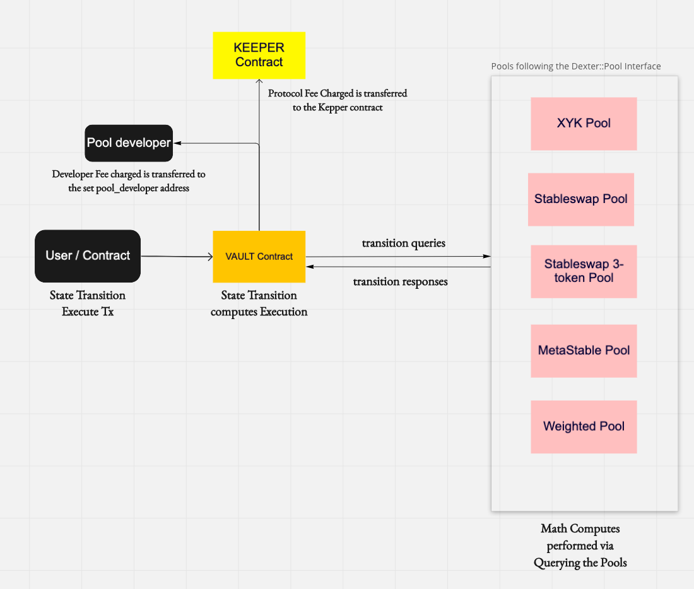

## **Dexter :: Architecture Overview**

Dexter is the first DEX which is implemented as a generalized state transition executor where the transition’s math computes are queried from the respective Pool contracts, enabling a decentralized, non-custodial aggregated liquidity and exchange rate discovery among different tokens on Persistence.



At launch, Dexter will be supporting the following pool types,

- XYK Pool
- Stableswap Pool
- Stable5Pool
- Weighted Pool

## Development

### Dependencies

- Rust v1.44.1+
- `wasm32-unknown-unknown` target
- Docker
- [LocalTerra](https://github.com/terra-project/LocalTerra)
- Node.js v16

### Envrionment Setup

1. Install `rustup` via https://rustup.rs/

2. Add `wasm32-unknown-unknown` target

```sh
rustup default stable
rustup target add wasm32-unknown-unknown
```

3. Install Node libraries required:

```bash
cd scripts
npm install
```

3. Deploy scripts:

```
Persistence testnet: https://rpc.testnet.persistence.one:443, test-core-1
Persistence mainnet: https://rpc.persistence.one:443, core-1
```

This is currently a WIP.

```bash
node --experimental-json-modules --loader ts-node/esm testnet_deploy.ts
```

4. Persistence network MAINNET details -
   export CHAIN_ID="core-1"
   export RPC_CLIENT_URL="https://rpc.persistence.one:443"

5. Persistence network TESTNET details -
   export CHAIN_ID="test-core-1"
   export RPC_CLIENT_URL=" https://rpc.testnet.persistence.one:443"

### Compile

Make sure the current working directory is set to the root directory of this repository, then

```bash
cargo build
docker run --rm -v "$(pwd)":/code \
  --mount type=volume,source="$(basename "$(pwd)")_cache",target=/code/target \
  --mount type=volume,source=registry_cache,target=/usr/local/cargo/registry \
  cosmwasm/workspace-optimizer:0.12.6
```
