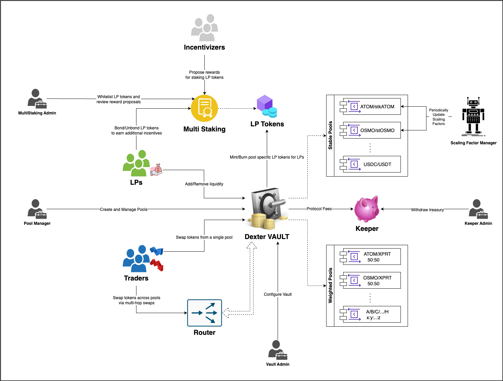

## **Dexter :: Architecture Overview**

Dexter is the first DEX which is implemented as a generalized state transition executor where the transition’s math computes are queried from the respective Pool contracts, enabling a decentralized, non-custodial aggregated liquidity and exchange rate discovery among different tokens on Persistence.



### Scope

At launch, it will support the Stable Pool type (introduced by curve) and the Weighted pool type (introduced by balancer), each of which designed for the following objectives:

* **Stable Pool**: Can be leveraged to develop specialized pools for liquid staking assets which can provide best trade execution.
* **Weighted Pool**: Can be leveraged to develop re-balancing driven pool strategies which can maximize LP returns.

Router can be used to perform trades across different pools in one go, while Multitasking (a modified version of the [Anchor staking contract](https://github.com/Anchor-Protocol/anchor-token-contracts/tree/main/contracts/staking)) can be used to incentivize pool’s LP tokens with rewards that is given by any 3rd party.

## Development

### Dependencies

- Rust v1.44.1+
- `wasm32-unknown-unknown` target
- Docker

### Envrionment Setup

* Install `rustup` via https://rustup.rs/
* Add `wasm32-unknown-unknown` target
    ```bash
    rustup default stable
    rustup target add wasm32-unknown-unknown
    ```
* Compile contracts, test them and generate wasm builds. Make sure the current working directory is set to the root directory of this repository, then
    ```bash
    cargo build
    cargo test
    docker run --rm -v "$(pwd)":/code \
      --mount type=volume,source="$(basename "$(pwd)")_cache",target=/code/target \
      --mount type=volume,source=registry_cache,target=/usr/local/cargo/registry \
      cosmwasm/workspace-optimizer:0.12.12
    ```
* Use [dexter deploy cli](https://github.com/dexter-zone/dexter-deployment-cli) to deploy them on the persistence network.
